<h1 align="center">Hi, I'm Kunal Jadhav 👋</h1>

  <strong>Full-Stack Developer · Banking Systems · AI Applications · AWS</strong>

  <a href="https://kunaltech.vercel.app/">Portfolio</a> &nbsp; • &nbsp;
  <a href="https://www.linkedin.com/in/kunaltech">LinkedIn</a> &nbsp; • &nbsp;
  <a href="mailto:kunaljadhav2305@gmail.com">Email</a> &nbsp; • &nbsp;
  <a href="https://github.com/mr-kunal-07?tab=repositories">Repositories</a>

  <picture>
    <source media="(prefers-color-scheme: dark)" srcset="assets/typing-dark.svg" />
    <source media="(prefers-color-scheme: light)" srcset="assets/typing-light.svg" />
    
  </picture>

Based in India · Currently at IDSSPL Technologies · Learning Data Science

<table>
  <tr>
    <td width="33%" valign="top">
      <h3>🏦 Banking</h3>
      <strong>25+ functional modules</strong>
      
Customer onboarding, accounts, transactions, deposits, loans, clearing, lockers, payroll and reporting.

    </td>
    <td width="33%" valign="top">
      <h3>🧠 AI Development</h3>
      <strong>Local model fine-tuning</strong>
      
Granite 8B with MLX-LM and QLoRA/LoRA adapters. Banking chatbot and dashboards driven by user prompts.

    </td>
    <td width="33%" valign="top">
      <h3>☁️ Cloud</h3>
      <strong>AWS application hosting</strong>
      
EC2 for compute, S3 for storage and CloudFront for content delivery.

    </td>
  </tr>
</table>

## /build — What I'm Building

I work across **frontend, backend and AI** at **IDSSPL Technologies**, developing 25+ Core Banking System modules with React, TypeScript and Java Spring Boot.

- **Banking workflows:** Responsive interfaces, validated REST APIs and maker-checker authorization.
- **Reporting:** Dynamic table and column selection, drag-and-drop layouts, previews, and PDF and Excel exports.
- **AI chatbot:** Guides users through the Core Banking System and its workflows.
- **AI dashboard:** Displays requested data and insights in one view based on user prompts.
- **Local AI:** Fine-tune Granite 8B using MLX-LM and QLoRA/LoRA adapters, serve customized responses through Python/Flask APIs, and use Ollama for base-model inference.

## /flow — How My Work Connects

  <picture>
    <source media="(prefers-color-scheme: dark)" srcset="assets/workflow-dark.svg" />
    <source media="(prefers-color-scheme: light)" srcset="assets/workflow-light.svg" />
    
  </picture>

**Fine-tuning:** Training data → MLX-LM + QLoRA/LoRA → Local model + trained adapter.  
**Base-model inference:** Ollama.

## /stack — Tech Stack

| Area | Technologies |
| :--- | :--- |
| **Languages** | Java · TypeScript · JavaScript · Python · SQL |
| **Frontend** | React.js · Next.js · Tailwind CSS · Redux |
| **Backend** | Spring Boot · Microservices · Spring Data JPA · Node.js · REST APIs |
| **Databases** | Oracle · PostgreSQL · MongoDB · Firebase |
| **AI** | IBM Granite 8B · MLX-LM · QLoRA/LoRA · Ollama · Flask |
| **Cloud and Tools** | AWS EC2 · S3 · CloudFront · Git · Jenkins · Postman |

## /projects — Selected Projects

<table>
  <tr>
    <td width="50%" valign="top">
      <h3>Multi.ai</h3>
      
<strong>AI SaaS application</strong>

      
Content generation, image editing and resume review, with authentication and subscriptions.

      
<code>React</code> <code>Node.js</code> <code>Express.js</code> <code>PostgreSQL</code>

    </td>
    <td width="50%" valign="top">
      <h3>AI Code Reviewer</h3>
      
<strong>Code review assistant</strong>

      
Gemini-powered code analysis and improvement suggestions, with an interactive React editor.

      
<code>React</code> <code>Node.js</code> <code>Express.js</code> <code>MongoDB</code>

    </td>
  </tr>
</table>

<strong>Explore project features and integrations</strong>

**Multi.ai:** Integrates Gemini, OpenAI and ClipDrop APIs, Clerk authentication and subscriptions, and Cloudinary storage. Deployed with Vercel.

**AI Code Reviewer:** Uses Gemini for code review and Prism.js for syntax highlighting in a React editor.

[Browse my repositories →](https://github.com/mr-kunal-07?tab=repositories)

## /experience — Experience

<strong>IDSSPL Technologies · Front-End Developer · July 2026 – Present</strong>

- Develop 25+ Core Banking System modules using React.js, TypeScript and Tailwind CSS across customer onboarding, accounts, cash and transfer transactions, deposits, loans, lockers, clearing, payroll and reporting.
- Develop Java Spring Boot microservices using Spring Data JPA and Oracle SQL across master configuration, account controls and instruments, branch operations, payments, financial closing and reporting.
- Implement REST API integration, form validation, bank- and branch-scoped lookups, pagination, search and maker-checker authorization workflows.
- Build dynamic reporting features with table and column selection, drag-and-drop layouts, previews, and PDF and Excel exports.
- Develop an AI chatbot and prompt-driven AI dashboard; fine-tune Granite 8B using MLX-LM and QLoRA/LoRA adapters and serve customized responses through Python/Flask APIs.
- Maintain regression tests and Postman collections, and support Jenkins deployment pipelines.

<strong>Oohpoint · Junior Software Developer · January 2025 – March 2026</strong>

- Developed Next.js and Firebase features for a micro-gig campaign platform serving **2,400+ users** and handling **INR 18 lakh+ in transaction volume**.
- Built backend APIs, role-based dashboards, authentication and payment integrations.
- Implemented geofencing and OTP verification for campaign engagement validation.

## Beyond the Code

🌱 Currently learning **Data Science** and exploring practical applications of AI.

  <strong>Have a project in mind?</strong> 
  <a href="mailto:kunaljadhav2305@gmail.com">Let's connect</a>

